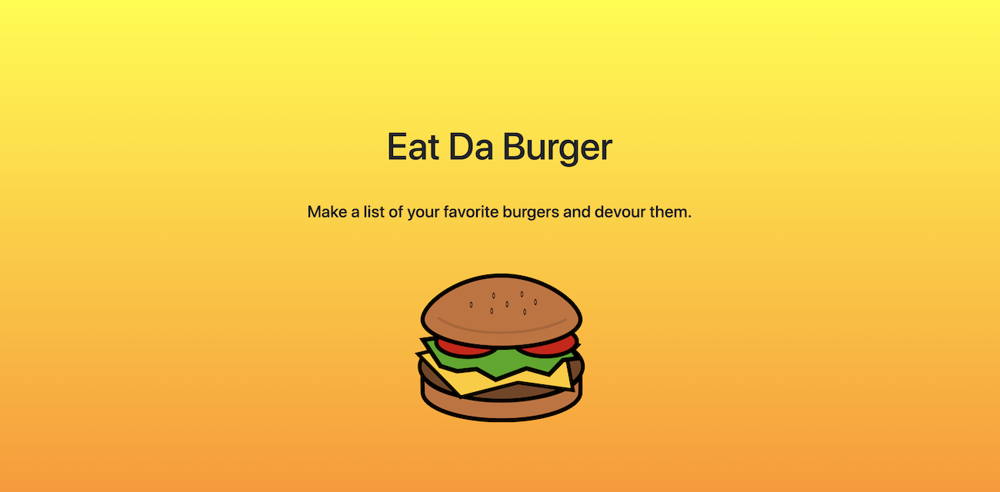

# Eat Da Burger

---

### Eat da Burger is a full stack app using Express-Handlebars, Express, Node.js and MySQL.

On this app users can:

-   Add their favorite burgers to a favorite burger list.
-   Mark burgers as devoured, sending the burger to the devoured list.
-   Delete burgers from the devoured burger list.

[Click here to see the app flow chart.](https://www.lucidchart.com/invitations/accept/20aed70b-5887-46fd-a74f-2710ebade132)
